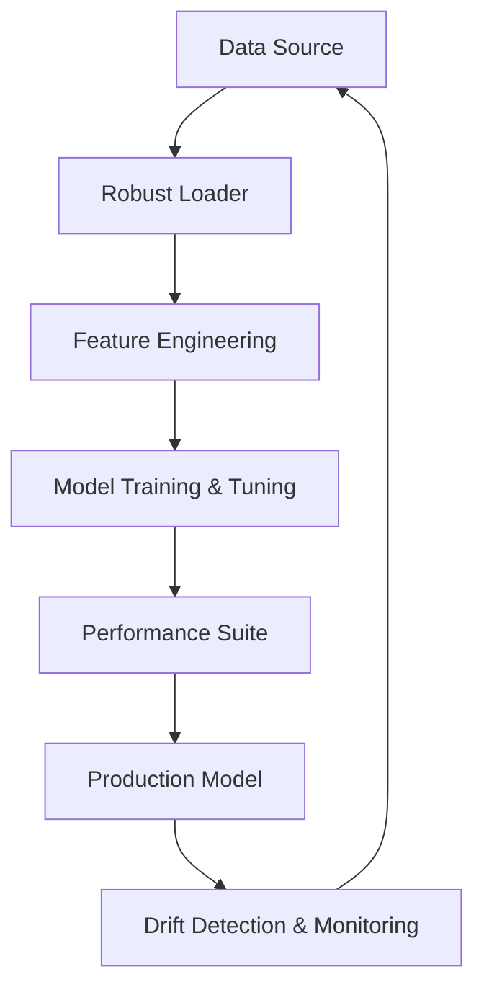

# Aether-Data-Science-Forge 🚀

[](https://github.com/AaronAdcock/Aether-Data-Science-Forge/actions/workflows/production.yml)
[](https://github.com/AaronAdcock/Aether-Data-Science-Forge)
[](https://www.python.org/downloads/release/python-390/)

Professional enterprise-grade MLOps platform for automated data processing, model training, and production-ready inference.

## Enterprise Architecture



Our architecture follows modern MLOps principles:
- **Modular Design:** Separate components for data loading, feature engineering, and evaluation.
- **Config-Driven:** All parameters are externalized in `configs/model_config.yaml`.
- **Observable:** Integration with Prometheus and drift detection for real-time monitoring.
- **Robustness:** Built-in validation using Pydantic and comprehensive testing.

## API Reference

### Data Loader
- `load_data(path: str)`: Robust loading with Pydantic validation.
- `validate_schema(df: pd.DataFrame)`: Schema enforcement.

### Feature Engineering
- `automated_scaling(df: pd.DataFrame)`: Robust scaler integration.
- `encode_features(df: pd.DataFrame)`: Automated encoding for categorical features.

## Monitoring & Observability

Built-in support for:
- **Prometheus Metrics:** Exporting training and inference metrics.
- **Drift Detection:** Monitoring data distribution shifts.
- **Performance Reports:** Automated generation of ROC-AUC and PR curves.

## Development Guide

### Prerequisites
```bash
pip install -r requirements.txt
```

### Running the Orchestrator
```bash
python main.py train --config configs/model_config.yaml
python main.py evaluate --model_path models/latest.joblib
```

## Future Roadmap
- [ ] Multi-cloud support (Azure/AWS/GCP).
- [ ] Automated A/B testing framework.
- [ ] Integrated Model Registry with MLflow.
- [ ] Real-time drift alerting via Slack/PagerDuty.

## Contributing
Please see [CONTRIBUTING.md](CONTRIBUTING.md) for guidelines.
